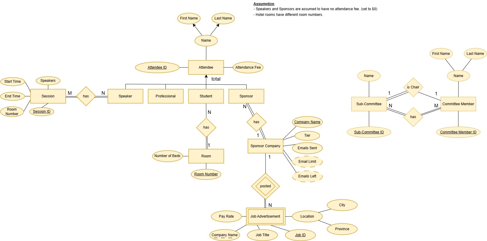

# CISC 332: Relational Model Implementation 

The first assignment dealt with creating an ER diagram based on the given requirements provided. 

All the following information was taught in class:

An entity-relationship (ER) diagram covers the conceptual design within the phases of database design. It describes the database at a high-level, and conveys the meaning and structure of the database. A database is modelled as a collection of entities, attributes, and relationships among entities. 

The following is my own ER diagram:

<div align="center">    
    </img>
    <figcaption></figcaption>
</div> 

Within the ```relational_database``` folder, there should be a ```conferenceDB.ddl```. 

There are some key instructions:
- Include the primary key and foreign keys.
- Include ```NOT NULL``` constraints for each table/attribute.
- Populate the table with reasonable data. At least 6-8 tuples for each table is expected. Adding data should be done by a series of insert statements in the script.
- Specify the "on delete" constraints for any foreign keys. 
- The foreign key checking should not be turned off. Arrange statements so that the script runs with the foreign key constraint violations.

The script should work in MySQL prior to submission, and must run without error. 

The script must use the translation used in class.

The algorithm for class is as follows:

1. Process all *strong entities*.
    - Action: Convert the strong entity into a relation (table).
    - Steps:
        - Make each strong entity a relation.
        - Add all the "simple" attributes as attributes, and identify the primary key.
2. Process all *weak entities*.
    - Action: Convert the weak entity into a relation (table).
    - Steps: 
        - Make each weak entity a relation.
        - Add all the "simple" attributes as attributes.
        - Add the primary key of the parent entity (or entities) as a foreign key of this relation, and make it ```NOT NULL```.
3. Process the *specialization hierarchy*.
    - Method 1:
        - Action: Create a relation (table) for the superclass, and a table for each subclass.
        - Steps:
            - Create an entity for each super and subclass with the primary key being the primary key of the superclass. The primary key of the sub-classes will be a foreign key referencing the super class entity.
    - Method 2:
        - Action: Create a table for each subclass, including all attributes of the superclass.
        - Steps: Create an entity for each sub-class (no entity for the super-class) including all attributes (and primary) key of the superclass as well as all local attributes.
4. Process the *many to many (N:M)* relationships.
    - Action: Convert each N:M relationship into a relation (table).
    - Steps:
        - Make each N:M relationship a relation (table).
        - Add the primary key from each of the participating entities as foreign keys.
        - The primary key will be the combination of the primary keys from the participating entities.
        - Any attributes of the relationship as an attribute in the relation.
5. Process the *one to many (1:N)* relationships.
    - Action: Add the primary key of the "1" side entity as a foreign key in the relation (table) on the "N" side.
    - Steps:
        - any attributes associated with the relationship are put into the same relation (with the foreign key).
6. Process the *1:1* relationships.
    - Action: Add the primary key of one entity as a foreign key in the other entity's relation (table). 
    - Steps:
        - Try to reduce the need for "NULL" entries.
7. Process the *multi-valued* attributes.
    - Action: Create a new relation (table) for each multi-valued relationship.
    - Steps:
        - Add the multi-valued attribute and the primary key of the entity to which this attribute belongs.
        - The primary key will be a foreign key in this new relation.
        - The primary key will be a combination of the multi-valued attribute and the foreign key attribute.
